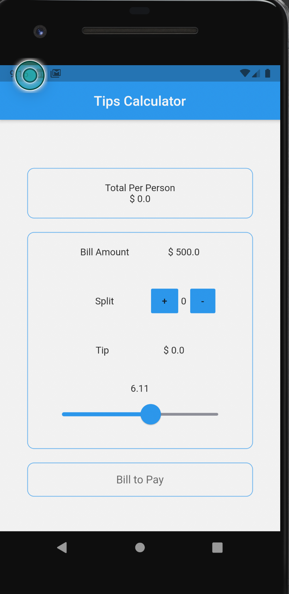
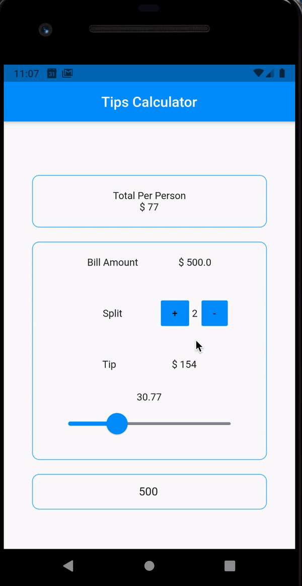

# tips_calculator

A calculator to quickly help you decide on how much to tip.
<table>
   <tr>
     <td>
       
    </td>
    <td>
       
  </td>
   </tr>
</table>

A few resources to get you started if this is your first Flutter project:

- [Lab: Write your first Flutter app](https://flutter.dev/docs/get-started/codelab)
- [Cookbook: Useful Flutter samples](https://flutter.dev/docs/cookbook)

